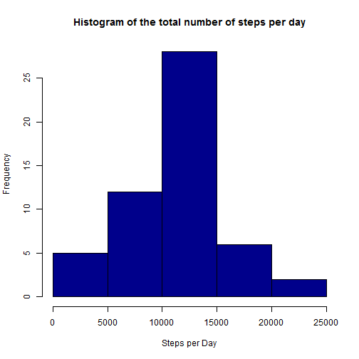
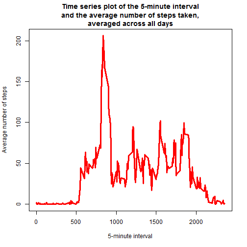
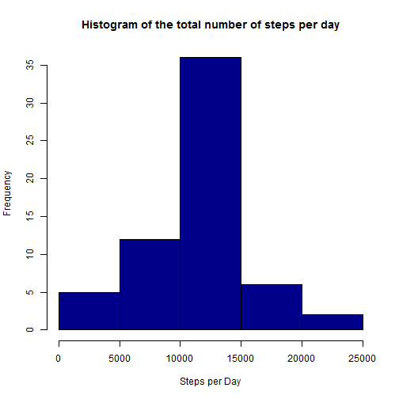

# Reproducible Research: Peer Assessment 1

This assignment makes use of data from a personal activity monitoring device. This device collects data at 5 minute intervals through out the day. The data consists of two months of data from an anonymous individual collected during the months of October and November, 2012 and include the number of steps taken in 5 minute intervals each day.

## Loading and preprocessing the data
### Load the data

The data for this assignment can be downloaded from the [course web site](https://d396qusza40orc.cloudfront.net/repdata%2Fdata%2Factivity.zip)

The dataset is stored in a comma-separated-value (CSV) file and there are a total of 17,568 observations in this dataset. To use the data we need to download and unzip it first.

```r
if (!file.exists("activity.zip")) download.file("https://d396qusza40orc.cloudfront.net/repdata%2Fdata%2Factivity.zip", 
    destfile = "activity.zip")
unzip("activity.zip")
activity <- read.csv("activity.csv")
```


### Process/transform the data  into a format suitable for analysis
The variables included in this dataset are:

* steps: Number of steps taking in a 5-minute interval (missing values are coded as NA)
* date: The date on which the measurement was taken in YYYY-MM-DD format
* interval: Identifier for the 5-minute interval in which measurement was taken

So, it is necessary to transform interval to factor and date to date format after read.


```r
activity$date <- as.Date(activity$date)
activity$interval <- as.factor(activity$interval)
```


The result of stage 1 is


```r
dim(activity)
```

```
## [1] 17568     3
```

```r
summary(activity)
```

```
##      steps            date               interval    
##  Min.   :  0.0   Min.   :2012-10-01   0      :   61  
##  1st Qu.:  0.0   1st Qu.:2012-10-16   5      :   61  
##  Median :  0.0   Median :2012-10-31   10     :   61  
##  Mean   : 37.4   Mean   :2012-10-31   15     :   61  
##  3rd Qu.: 12.0   3rd Qu.:2012-11-15   20     :   61  
##  Max.   :806.0   Max.   :2012-11-30   25     :   61  
##  NA's   :2304                         (Other):17202
```

```r
head(activity)
```

```
##   steps       date interval
## 1    NA 2012-10-01        0
## 2    NA 2012-10-01        5
## 3    NA 2012-10-01       10
## 4    NA 2012-10-01       15
## 5    NA 2012-10-01       20
## 6    NA 2012-10-01       25
```


## What is mean total number of steps taken per day?

For this part of the assignment, the missing values in the dataset is ignored.

А histogram of the total number of steps taken each day is made


```r
StepsPerDay <- tapply(activity$steps, activity$date, sum, na.r = T)
hist(StepsPerDay, xlab = "Steps per Day", col = "darkblue", main = "Histogram of the total number of steps per day")
```



The mean and median total number of steps taken per day are Calculated and reported


```r
mean(StepsPerDay, na.r = T)
```

```
## [1] 10767
```

```r
median(StepsPerDay, na.r = T)
```

```
## [1] 10766
```


## What is the average daily activity pattern?

The average number of steps taken, averaged across all days  are calculated  in a new variable "Step5m". A time series plot (i.e. type = "l") of the 5-minute interval (x-axis) and "Step5m" (y-axis) is ploted.


```r
Step5m <- tapply(activity$steps, activity$interval, mean, na.r = T)
plot(names(Step5m), Step5m, type = "l", xlab = "5-minute interval", ylab = "Average number of steps", 
    col = "red", lwd = 3, main = "Time series plot of the 5-minute interval\nand the average number of steps taken,\naveraged across all days")
```




The 5-minute interval, on average across all the days in the dataset, contains the maximum number of steps is


```r
cat("The 5-minute interval is number", names(which(Step5m == max(Step5m))))
```

```
## The 5-minute interval is number 835
```


## Imputing missing values

The total number of missing values in the dataset are calculated and reported


```r
colSums(is.na(activity))
```

```
##    steps     date interval 
##     2304        0        0
```


Only "steps" variable has a missing value for 2304 rows in the dataset.

A strategy for filling in all of the missing values in the dataset is devised to use the mean for that 5-minute interval. There are 61 days in dataset.


```r
MissingValueIndex <- is.na(activity$steps)
meandata <- rep(Step5m, length(levels(as.factor(activity$date))))
```


Create a new dataset that is equal to the original dataset but with the missing data filled in


```r
newdataset <- activity
newdataset$steps[MissingValueIndex] <- meandata[MissingValueIndex]
```


We make a histogram of the total number of steps taken each day. 


```r
StepsPerDay2 <- tapply(newdataset$steps, newdataset$date, sum, na.r = T)
hist(StepsPerDay2, xlab = "Steps per Day", col = "darkblue", main = "Histogram of the total number of steps per day")
```



We calculate and report the mean and median total number of steps taken per day.


```r
mean(StepsPerDay2, na.r = T)
```

```
## [1] 10767
```

```r
median(StepsPerDay2, na.r = T)
```

```
## [1] 10767
```


Do these values differ from the estimates from the first part of the assignment?


```r
print(mean(StepsPerDay2, na.r = T) - mean(StepsPerDay, na.r = T))
```

```
## [1] 0
```

```r
print(median(StepsPerDay2, na.r = T) - median(StepsPerDay, na.r = T))
```

```
## [1] 1.189
```


Since we added the average values, then there was only a slight shift of the median. Thus, in this case the impact of imputing missing data on the estimates of the total daily number of steps is not significant.

## Are there differences in activity patterns between weekdays and weekends?

Create a new factor variable in the dataset with two levels – “weekday” and “weekend” indicating whether a given date is a weekday or weekend day.


```r
Sys.setlocale("LC_TIME", "English")  # Some wizards
```

```
## [1] "English_United States.1252"
```

```r
wdays <- weekdays(newdataset$date)
newdataset$WD <- factor("weekday", levels = c("weekday", "weekend"))
newdataset$WD[wdays == "Saturday" | wdays == "Sunday"] <- "weekend"

```

Make a panel plot containing a time series plot of the 5-minute interval (x-axis) and the average number of steps taken, averaged across all weekday days or weekend days (y-axis). 

```r
tmp <- aggregate(steps ~ interval + WD, data = newdataset, mean)
tmp$interval <- as.numeric(as.character(tmp$interval))
library(lattice)
xyplot(steps ~ interval | WD, data = tmp, type = "l", layout = c(1, 2), ylab = "Number of steps", 
    xlab = "Interval")
```

 


